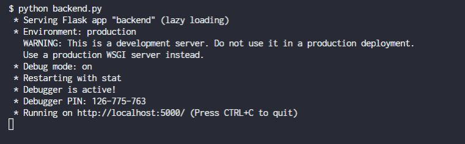

# Setting up environment

## 1. Install python:

Python is recommended to be installed via Anaconda.

https://www.anaconda.com/products/individual

## 2. Setup conda environment

Install from environment.yml file using

> `conda env create -f environment.yml`

A conda environment will bre automatically created with all the required dependencies.

Activate the environment using

> `activate IS5009`

# Starting app

In the same folder as `backend\`, run

> `python backend.py`

You should see:

This means that the server is up and running successfully.