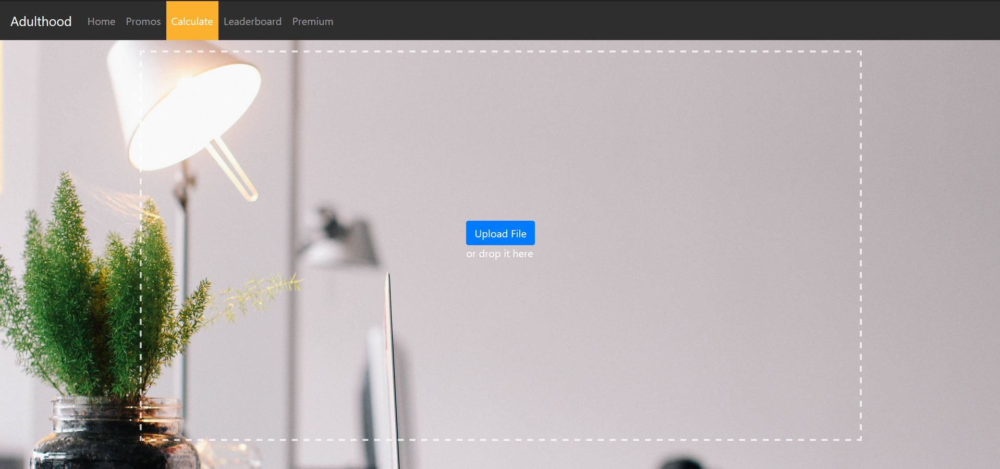

This project was bootstrapped with [Create React App](https://github.com/facebook/create-react-app).

# Setting up environment

## 1. Install Nodejs

https://nodejs.org/en/

Nodejs is a javascript framework for backend development.

## 2. Install packages

Inside the folder `frontend\`, run on the command line

> `node install`

This will install all the dependencies as listed in `package.json` in the subfolder `node_modules`.

# Starting app

In the project directory, you can run:

> `npm start`

The website should automatically launch in your browser and you will see:

If it does not launch automatically, you can also navigate there manually by entering `http://localhost:3000/` in the browser.

> :warning: Make sure the backend is running otherwise the website will not work properly!