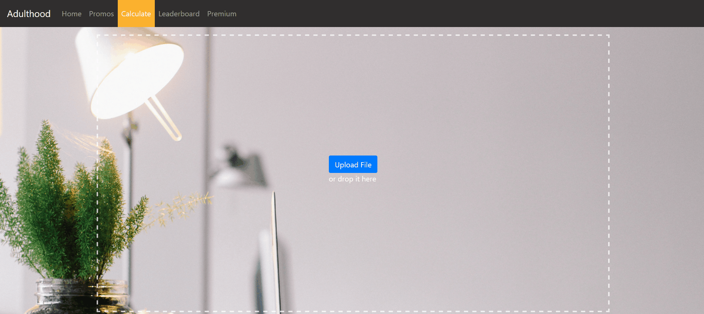

# IS5009 Prototype App (MVP)

## Overview

This is a simple frontend-backend setup that demonstrates the main functionalities of Adulthood:

- cashback calculation
- file upload
- results display

The backend is built in Flask (python), while the frontend is built with Nodejs (javascript).

## Workflow

A user uploads his credit card data on the web UI (hosted by the frontend server), which then transmits the data to the relevant API endpoints (hosted on the backend server). The backend performs the required business logic and returns a result back to be displayed to the user on the frontend.

## Environment setup

Please refer to the individual readme files in `backend` and `frontend` folders for further instructions.

## Running the App

Both the backend and frontend servers need to be running at the same time.

Please refer to the individual readme files on how to run them.

